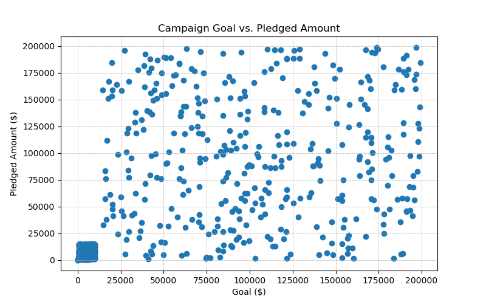
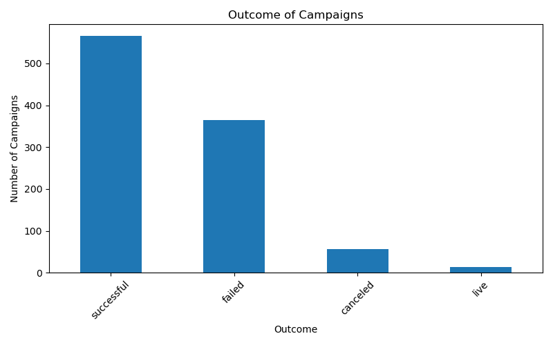

# Crowdfunding

## Overview

Crowdfunding is a modern fundraising method where individuals and organizations collect small amounts of money from a large audience, typically via the internet. It democratizes the funding process, relying on the collective support of backers, often facilitated through social media and specialized platforms. This approach is popular for a wide range of initiatives, from innovative products and artistic endeavors to personal causes and charitable projects. Crowdfunding campaigns not only secure financial backing but also validate ideas and engage communities, turning audiences into advocates for the cause.

## Data Sources:

An Excel file “crowdfunding.xlsx ” was provided for further study 
and analysis.

## Data Transformation and Analysis:

Each section was cleaned, manipulated and transformed (ETL Process) and analyzed . these involve  Some basic data wrangling tasks like filtering, grouping and summarizing the data.

## Visualizations:

Some basic visualizations was done through matplotlib for Campaign Goal Vs Pledged Amount

 

- This plot is helpful for getting a quick sense of the overall performance of campaigns relative to their goals and can be a staring point for more in depth analysis

- Data points are spread out across the plot, which indicates a variety of of goals and pledged amounts

- There is a noticeable concentration of data points toward the left corner, suggesting that many campaigns have lower goal and correspondingly the amount pledged to these campaigns is also lower.

- Ther are campaigns with higher goals that have relatively lower pledged amounts. Which could indicate that did not meet their goals.

## Campaigns Out-Come

 

- This visualization helps in quickly assessing the relative frequency of the different outcomes of the campaign in the dataset.

- The successful category has the highest number of campaigns, indicating most campaigns in the dataset achieved their goal.

- The failed category has the second highest count. And the third place is cancelled  with less number of counts.

- Live campaigns are likely those that are are currently active and have not yet reached an outcome.

## Exported the below files from the ETL :
- category.csv

- subcategory.csv

- campaign.csv

- contacts.csv

